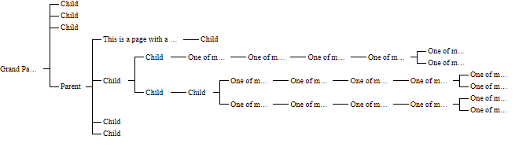
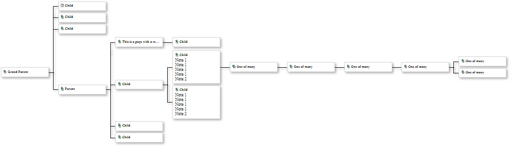
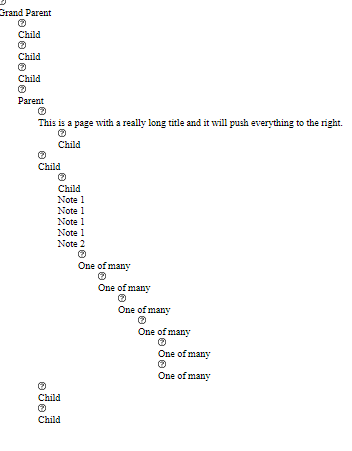

# Simple HTML Tree

## How to use

### Minimum

The minimal configuration requires main.js to render the HTML and main.css to style the items and relationships.



#### Files

- main.js - Creates the html using JavaScript templates
- main.css - Styles the entities and relationships

#### Item Data

The item data requires a unique id, and children with unique id.

```JSON
  {
    "id": 1, 
    "children": [
      { "id": 2 } 
    ]
  }
```

### Customization

#### Custom Item Data

The item data requires a unique id, and children with unique id. All other data is optional.

```JSON
  {
    "id": 1, // Should be unique.
    "title": "Template variable", // This is the default label when there is no customContent, otherwise the id will display
    "notes": [], // Example Template variable
    "faviconUrl": "", // Example Template variable
    "customContent": "Function(item)" // Used to render content
    "children": [
      { "id": 2 } 
    ]
  }
```

#### Custom Content (customContent)

If there is a customContent function, it will be called with the itemInfo to render the item inside the div with the class "item-contents-display".

If there is no customContent function on the item, the title (if there is one) or id will display in the rectangle.

Set the function once at the root item where it is inherited by all children. In the rendering of children, the customContent function is copied to the child along with a reference to the parent. The function customContent has access to the child and parent info.

## Realizations

### Hierarchies are not Graphs

Unlike graphs with nodes and edges, hierarchical data has a controller-to-controlled relationship such as parent-child or supervisor-subordinate. This makes identifying the relationships and managing them easier.

- Assumptions of inheritance are possible.
- The rectangle of space is determined by the parent and all descendants.

### Horizontal vs. Vertical vs. Centered is controlled by the parent positioning the children

After coding this layout:


The CSS broke and this image is what triggered the realization.



### Rendering of relationships is controlled by sibling type

If an item has childeren, there is a line from the parent.
All childern have a line to toward the parent. Siblings have a connecting line to other siblings.
The connecting line is determined by the sibling order:

- only-child - has no connecting line to other siblings.
- first-child - the connecting line starts at the line to the parent and extends toward siblings.
- middle-child - the connecting line extends toward both the first-child and the last-child
- last-child - the connecting line starts at the line toward the parent and extends toward siblings.
